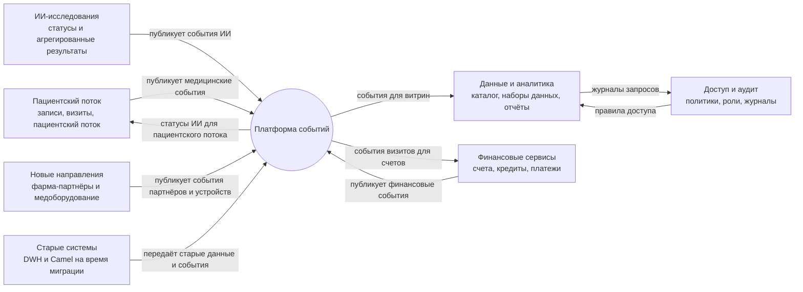

# Схема bounded contexts

| Bounded context | Ответственность | Роль в системе |
| --- | --- | --- |
| Пациентский поток | Записи на приём, визиты, поток пациентов между клиниками | Основной домен |
| Финансовые сервисы | Кредиты, счета, платежи | Основной домен |
| ИИ-исследования | Статусы ИИ-исследований и агрегированные результаты | Вспомогательный домен |
| Новые направления | Данные фарма-партнёров и медоборудования | Вспомогательный домен |
| Данные и аналитика | Каталог, наборы данных, витрины и отчёты | Вспомогательный домен |
| Доступ и аудит | Политики доступа, роли, аудит действий | Общий сервис |
| Старые системы | Временный слой для старого DWH и Apache Camel | Временный слой на время миграции |
