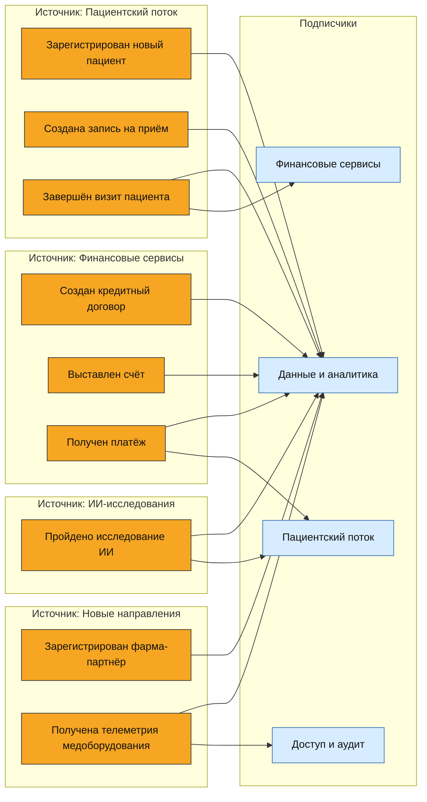

# Event Storming

| Событие | Источник | Основные подписчики |
| --- | --- | --- |
| Зарегистрирован новый пациент | Пациентский поток | Данные и аналитика |
| Создана запись на приём | Пациентский поток | Данные и аналитика |
| Завершён визит пациента | Пациентский поток | Финансовые сервисы, данные и аналитика |
| Создан кредитный договор | Финансовые сервисы | Данные и аналитика |
| Выставлен счёт | Финансовые сервисы | Данные и аналитика |
| Получен платёж | Финансовые сервисы | Пациентский поток, данные и аналитика |
| Пройдено исследование ИИ | ИИ-исследования | Пациентский поток, данные и аналитика |
| Зарегистрирован фарма-партнёр | Новые направления | Данные и аналитика |
| Получена телеметрия медоборудования | Новые направления | Данные и аналитика, доступ и аудит |
